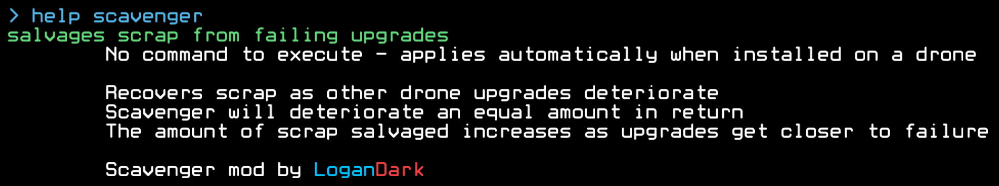
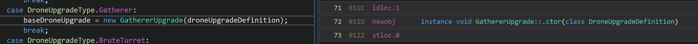

# DuskersScavenger



---

In Duskers, scrap is very scarce. There is always something to spend your scrap on, and you often don't have enough of it. In the base game, there is no way to increase this rate, other than perhaps changing the difficulty setting in the options menu.

The Scavenger mod offers a solution. Drone upgrades naturally lose material over time due to the drones moving around and using them. Scavenger allows this material to be recovered as scrap that can be put towards repairs or upgrades.

The downside: Scavenger itself deteriorates as it is used. In fact, it deteriorates at the same rate as all other upgrades combined. This means that if any upgrade breaks, Scavenger will also break.

However, in return for this breakage, your drone *is* able to salvage some final pieces of scrap. This covers both breakages plus one extra, presumably from the broken material left behind on the mission.

---

This is a fully standalone mod for Duskers (i.e. no mod framework or library needed) that only adds a new drone upgrade. It's fully functional and integrated into the game - it shows up in the help menu, saves and loads, is obtainable randomly in derelicts, etc.

The patches that make this possible are smart and flexible and can (probably) be reused by multiple different mods without breaking.

Installation instructions can be found on the [DuskersGive](https://github.com/LoganDark/DuskersGive) page; namely, this mod should be loaded by UnityModManager.

The specific steps I had to follow to add a new upgrade are:

- Find a new upgrade ID. The `DroneUpgradeType` enum holds the IDs of all vanilla upgrades, so I *could* have just picked a static number outside of that, however that's not an optimal strategy and has similar problems to Minecraft back when they used numerical IDs.

  Namely: Collisions. Anyone who has used Forge back then knows that most mods had a config file that allowed you to change the IDs of their items. Mods tried to pick unique numbers on a best-effort basis, but collisions were basically inevitable so they relied on users to change the IDs when that happened. ID conflicts prevented the game from loading, and were a major annoyance.

  For the longest time, they continued to be an annoyance. Modpack authors had to go through all of their mods' config files and change the item IDs so that they wouldn't overlap. Eventually, Forge (one of the mod loaders) came out with a system that picked these IDs automatically, and suddenly all problems of conflicts went away. These IDs were stored in the save file so that they would match up every time the save was loaded, even if mods are added later.

  Thus, the solution to the problem was to allocate item IDs dynamically, not statically. If you generate them using code, you can automatically find an ID that isn't taken. My mod uses this strategy, and you should too. Take a look at the FindUpgradeId function if you're interested.

  I know you're concerned about saving. Obviously, that is a problem that I had to solve. More on that later.

- Add a new `DroneUpgradeDefinition` to to the internal, private, `_upgradeDefinitions` field of `DroneUpgradeFactory`. This is basically where you "register" your upgrades, although there are a few other places you have to patch as well. You'll have to cast your new ID to `DroneUpgradeType`. This is perfectly safe, as enums in C# are just integers.

- Create a class for the upgrade. Upgrades in the game don't just have a definition, they have an associated class. This class contains code that defines their behavior. `BaseDroneUpgrade` is, as the name implies, the base class for drone upgrades, so my class will have to inherit from this.

- Tell the game about the upgrade class. There is no registry mapping drone definitions to drone classes; there is a method instead. The method `DroneUpgradeFactory::CreateUpgradeInstance` handles creating a `BaseDroneUpgrade` from a `DroneUpgradeType`. This method calls their constructors directly, and as such, has a humongous switch statement containing every upgrade ID in the game. This is Slightly Annoying.

  Not only do I have to patch a method right in the middle (which means no Prefix or Postfix), but I have to add a case to a switch statement! If you're not already aware, C# switch statements can only handle sequential cases. That means if the last upgrade has an ID of 21 and my upgrade has an ID of 49153828, I can't add that as a case to the switch.

  Luckily, I can take inspiration from the C# compiler. If a switch statement has sparse cases, then it will be compiled into a chain of if-else statements instead. Since only my new case is sparse (the one with a potentially very large ID), I can just add an if statement right after the switch. Right?

  Well, I actually have to use a [transpiler](https://harmony.pardeike.net/articles/patching-transpiler.html) and insert the CIL version of an if statement... Which basically means the patch has to be coded in C# assembly. Luckily, C# assembly is stack-based and not too hard to learn.

  I can mimic the structure of one of the cases, even though my patch isn't actually adding a case. In dnSpy, I can view the CIL instructions of one of the cases to see which instructions I should use to instantiate my drone upgrade. Remember that the constructor takes one argument and the instance is going to be stored in a local variable. Both of these behaviors have to be present in my patch.

  

  The highlighted line of decompiled code is also highlighted in the CIL view, so we can see that line of code corresponds to 3 CIL instructions. First, the local variable `droneUpgradeDefinition` is pushed to the stack using `ldloc.1`, then a new `GathererUpgrade` is created using its constructor that takes one argument, popping it off the stack and then pushing the new `GathererUpgrade`. Then, this new instance is stored inside of the `baseDroneUpgrade` local variable using `stloc.0`.

  Since the `GathererUpgrade` constructor is very unique and only called once in that function, I can easily locate it to copy the `ldloc.1` and `stloc.0` instructions from around it to use in my patch. This is generally good practice in case the game ever updates this function; anything short of a full rewrite shouldn't have to break my patch.

  So, game plan:

  1. Scrape up the `ldloc` and `stloc` instructions from the gather upgrade to use in the transpiler.
  2. Add a conditional after the switch that checks if the `DroneUpgradeType` corresponds to my upgrade. If it doesn't, jump past #3.
  3. Load the upgrade definition, instantiate the upgrade, and then store it in the local variable.

  You can take a look at the transpiler in [`Main.cs`](./Main.cs) if you're interested in the exact code used.

- Add the upgrade to the help manual. All upgrade entries in the help manual are actually commands; however, my upgrade doesn't need a command! Luckily, the vanilla game already has me covered. There is another upgrade that has an entry in the help menu, but no command: the speed boost upgrade!

  All commands are created from an XML file stored in `Duskers/Duskers_Data/resources.assets`. How do I know this? If you look at `CommandHelper::LoadCommandDefinitionLibrary` and `CommandHelper::GetCommandDefinitionFromXml` you'll see how all the vanilla commands are loaded. This includes the commands for drone upgrades.

  So, great! I opened up `resources.assets` in Notepad++ (which still works flawlessly even in binary files), and did a search for `speedboost` (which is what shows up in the help manual for the Speed Boost I upgrade). Here's what I found:

  ```xml
  	<CommandContext commandGroup="SpeedboostUpgrade">
  		<CommandDefinition name="speedboost" description="increases speed of drone" helpOnly="true">
  			<DetailedDescription message="&#x9;&#x9;No command to execute - applies automatically when installed on a drone" format="SmallFont" />
  		</CommandDefinition>
  	</CommandContext>
  ```

  It looks like the game has a special `helpOnly` attribute that excludes the command from being run. Great! It also looks like each upgrade has its own category. That's just an artifact of the commands having to be loaded from XML - I don't actually have to store my commands in `_commandDefinitions`, which is great because that's a private field.

  But how do I know this? Well, `_commandLookup` isn't actually where commands are registered. It's where *other methods* (such as `ICommandable::QueryAvailableCommands`) grab a list of `CommandDefinition`s to return. I can just as easily store that list in a static field, which is what I'll do.

  So, first I create the command list and populate it with a single command for my upgrade. Then, in my upgrade class, I return that list in `QueryAvailableCommands`, so that the game will hopefully pick it up. Does that work?

  NO. It doesn't, and here's why: The help menu also regrettably hardcodes every upgrade in the game (`HelpManualMenuHelper::RefreshDroneUpdadeMenu`, yes they misspelled Upgrade). Will I have to use another transpiler? Also no. Luckily the method is simply a chain of self-contained if statements. This means I can use a postfix to add one more for my upgrade.

  Again, for the complete code see [`Main.cs`](./Main.cs). But since this is so dead simple, I'll put a sample here:

  ```cs
  			public static void Postfix(HelpManualMenuHelper __instance, bool ___useSimpleHelp, HelpManualMenu ___droneUpgrades) {
  				if (___useSimpleHelp || GlobalSettings.DiscoveredUpgrades.Contains((DroneUpgradeType) upgradeId)) {
  					__instance.AddCommands(___droneUpgrades.MenuItems, commands);
  				}
  			}
  ```

- Make it save/load. My upgrade is in the game, and it can be given using [DuskersGive](https://github.com/LoganDark/DuskersGive). It doesn't do anything, but it shows up in the help menu and works everywhere you'd expect. There's a big issue though: the ID changes every time you start the game.

  If you open up the save file (`Documents/My Games/Duskers/gamesave.txt`), you will see something like this:

  ```
  DiscoveredUpgrades=AreaSensor,StealthField,Lure,Sensor,AreaSensor,StealthField,Lure,Sensor,AreaSensor,StealthField,Lure,Sensor,Shield,AreaSensor,StealthField,Lure,Sensor,AreaSensor,StealthField,Lure,Sensor,AreaSensor,StealthField,Lure,Sensor,571368866
  ```

  Of course, it will be much, much longer since the game has *issues* saving this field and doesn't deduplicate it, but it works to illustrate the issue. Every upgrade has a name... except for `571368866`. What is `571368866`?

  That's Scavenger! Well, that *used* to be Scavenger. Now it's just an integer that doesn't mean anything. It *is* the ID Scavenger chose when the game started. If I restart the game and spawn in another Scavenger, another mysterious integer will appear in that list. However, the game has no idea that random integer corresponds to Scavenger, because it doesn't! That integer could refer to any randomly generated upgrade, or none at all. It has no identifying information.

  Well this can't be good. Luckily, it's a mostly easy fix. In fact, it doesn't matter what the ID is at runtime as long as whatever I save can be loaded back up as my ID. If you pay very close attention and put on your thinking hat, you'll figure out that everything else is actually *named*.

  That's of course because they are a constant in the `DroneUpgradeType` enum! But Harmony can't add enum constants. Except I *totally can* make the game *recognize* my ID as corresponding to the constant `Scavenger`.

  Make sense? No? Well, the main way of converting to and from an Enum are using the `Enum::Parse` and `Enum::ToString` methods. **If I can patch these, my upgrade can save and load to a consistent string, `Scavenger`.** That means it won't matter what my ID is at runtime. Bingo!

  It's enough to simply add a prefix to both of these methods that checks if the enum type is `DroneUpgradeType` and the value being de/serialized is one of mine. For example, in `Enum::ToString`, used in the saving code, it's passed an `Enum` object and is tasked with serializing it to a string. I can just check if that enum is a `DroneUpgradeType` and equal to my ID, and if so, return `"Scavenger"` right away.

  In `Enum::Parse`, I can check if the desired type is `DroneUpgradeType` and the input is `"Scavenger"`. If so, I can just return the upgrade ID as a `DroneUpgradeType`.

  Only those two patches are required to make the upgrade persistent. Epic!

- Add functionality. This varies by upgrade, but in my case I had to hook some `DungeonManager::BeginExit` stuff to call into my upgrade when necessary, and I also had to hook `Drone::GetLootCount` so that my upgrade could generate scrap. Take a look at [`Main.cs`](./Main.cs) if you're interested in the specifics.

- Make it generate randomly. What, did you think this would be easy? After all that? Psh, naw. The code that chooses a random upgrade, in `DroneManager::RandomlyChooseUpgrades`, looks somewhat like this:

  ```cs
  	int iter = 0;
  	int id;
  
  	do {
  		id = rnd.Next(1, (int) DroneUpgradeType.NumberOfUpgrades);
  
  		if (firstPlaythrough && num5 == (int)DroneUpgradeType.BruteTurret)
  			id = 0; // guarantee no Turret upgrade on first playthrough
  
  		iter++;
  
  		if (iter > 100) // log error
  	} while (id == (int)DroneUpgradeType.Undefined || id == (int)DroneUpgradeType.SwarmTurret || id == (int)DroneUpgradeType.Repair); // guarantee no unreleased upgrades. these are excluded from being registered in `GlobalSettings::UPGRADE_IGNORE_ALWAYS_LIST`, so their commands won't work, among other things
  
  	droneUpgradeType = (DroneUpgradeType) id;
  ```

  That doesn't exactly work because my ID lies outside of the normal range. So, I have to insert a new routine after that which overrides the choice with one that takes custom upgrades into account. The specifics of finding the injection point are too complex to explain clearly here.

  As always you can find the code in [`Main.cs`](./Main.cs).

After all of that I had a fully functional, standalone mod that adds a new upgrade to the game. Compatibility with the Duskers Simple Modding Framework is still under way (I've done all I can, but they need to add support since their patches are a little too broad).

Enjoy!
